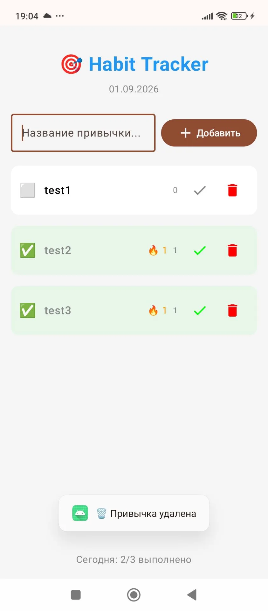

# 🎯 Habit Tracker

A cross-platform app for tracking daily habits. Two implementations: **Android (Kotlin/Compose)** and **Desktop/Mobile (Python/BeeWare)**.


---

## 🇷🇺 Описание на русском

Кроссплатформенное приложение для отслеживания ежедневных привычек. Две реализации: **Android (Kotlin/Compose)** и **Desktop/Mobile (Python/BeeWare)**.

### Возможности

- ✅ Добавление и удаление привычек
- ✅ Отметка выполнения на сегодня
- ✅ Подсчёт текущей серии (streak) 🔥
- ✅ Общее количество выполнений
- ✅ Статистика за день
- ✅ Автосохранение данных
- 🎨 Современный Material Design / минималистичный интерфейс

---
## 🇬🇧 Description in English

A cross‑platform app for tracking daily habits. Two implementations: **Android (Kotlin/Compose)** and **Desktop/Mobile (Python/BeeWare)**.

## ✨ Features

- ✅ Add and remove habits
- ✅ Mark habits as completed for today
- ✅ Track current streak 🔥
- ✅ Total completion count
- ✅ Daily statistics
- ✅ Auto-save data
- 🎨 Modern Material Design / minimalist interface

---

## 🏗️ Project Structure

```
MypythonApp/
├── app/                          # Android app (Kotlin + Compose)
│   ├── src/main/
│   │   └── java/com/zx_tole/mypythonapp/
│   │       ├── MainActivity.kt
│   │       ├── repository/
│   │       │   └── HabitRepository.kt
│   │       └── ui/
│   │           └── HabitTrackerScreen.kt
│   └── build.gradle.kts
├── habit_tracker/                # Python app (BeeWare/Toga)
│   ├── src/habit_tracker/
│   │   ├── __main__.py
│   │   └── app.py
│   ├── briefcase.toml
│   ├── pyproject.toml
│   └── requirements.txt
└── README.md
```

---

## 🚀 Quick Start

### Android (Kotlin)

1. Open the project in **Android Studio**
2. Sync Gradle files
3. Run on an emulator or device (minSdk = 24)

**Technologies:**
- Jetpack Compose (Material 3)
- Kotlin 1.9+
- Chaquopy (Python 3.11 integration)
- Coroutines + StateFlow
- Room (optional)
- CameraX, Navigation3, Retrofit

### Python (BeeWare)

```bash
# Create virtual environment
python3 -m venv venv
source venv/bin/activate  # Windows: venv\Scripts\activate

# Install dependencies
cd habit_tracker
pip install -r requirements.txt

# Run
python -m src.habit_tracker
```

**Build for platforms:**
```bash
# Install Briefcase
pip install briefcase

# macOS
cd habit_tracker
briefcase create macos && briefcase build macos && briefcase run macos

# Linux
briefcase create linux && briefcase build linux && briefcase run linux

# Windows
briefcase create windows && briefcase build windows && briefcase run windows
```

---

## 📸 Screenshots

### Android Version

| Main | Add | Completed |
|------|-----|-----------|
|  |  |  |

---

## 🧠 How It Works

### Data Model

```kotlin
data class Habit(
    val id: String,
    val name: String,
    val completedDates: List<String>,  // "yyyy-MM-dd"
    val createdAt: String
)
```

### Streak Calculation

1. Dates are sorted in descending order
2. Check if completed today or yesterday
3. Iterate backwards, counting consecutive days
4. Break in sequence → reset

---

## 🛠️ Tech Stack

| Component | Android | Python |
|-----------|---------|--------|
| Language | Kotlin 1.9+ | Python 3.11+ |
| UI | Jetpack Compose | BeeWare Toga |
| Architecture | MVVM (StateFlow) | OOP |
| Storage | In-memory + JSON | JSON |
| Extras | CameraX, Retrofit, Room | — |

---

## 📝 License

MIT

---

# 🎯 Трекер Привычек

Кроссплатформенное приложение для отслеживания ежедневных привычек. Две реализации: **Android (Kotlin/Compose)** и **Desktop/Mobile (Python/BeeWare)**.

## 🏗️ Структура проекта

```
MypythonApp/
├── app/                          # Android-приложение (Kotlin + Compose)
│   ├── src/main/
│   │   └── java/com/zx_tole/mypythonapp/
│   │       ├── MainActivity.kt
│   │       ├── repository/
│   │       │   └── HabitRepository.kt
│   │       └── ui/
│   │           └── HabitTrackerScreen.kt
│   └── build.gradle.kts
├── habit_tracker/                # Python-приложение (BeeWare/Toga)
│   ├── src/habit_tracker/
│   │   ├── __main__.py
│   │   └── app.py
│   ├── briefcase.toml
│   ├── pyproject.toml
│   └── requirements.txt
└── README.md
```

## 🚀 Быстрый старт

### Android (Kotlin)

1. Откройте проект в **Android Studio**
2. Синхронизируйте Gradle-файлы
3. Запустите на эмуляторе или устройстве (minSdk = 24)

**Технологии:**
- Jetpack Compose (Material 3)
- Kotlin 1.9+
- Chaquopy (интеграция Python 3.11)
- Coroutines + StateFlow
- Room (опционально)
- CameraX, Navigation3, Retrofit

### Python (BeeWare)

```bash
# Создайте виртуальное окружение
python3 -m venv venv
source venv/bin/activate  # Windows: venv\Scripts\activate

# Установите зависимости
cd habit_tracker
pip install -r requirements.txt

# Запустите
python -m src.habit_tracker
```

**Сборка для платформ:**
```bash
# Установка Briefcase
pip install briefcase

# macOS
cd habit_tracker
briefcase create macos && briefcase build macos && briefcase run macos

# Linux
briefcase create linux && briefcase build linux && briefcase run linux

# Windows
briefcase create windows && briefcase build windows && briefcase run windows
```

## 📸 Скриншоты

### Android-версия

| Главная | Добавление | Выполнено |
|---------|------------|-----------|
|  |  |  |

## 🧠 Как это работает

### Модель данных

```kotlin
data class Habit(
    val id: String,
    val name: String,
    val completedDates: List<String>,  // "yyyy-MM-dd"
    val createdAt: String
)
```

### Подсчёт серии (streak)

1. Даты сортируются по убыванию
2. Проверяется выполнение сегодня или вчера
3. Итерируемся назад, считая последовательные дни
4. Разрыв серии → сброс

## 🛠️ Стек технологий

| Компонент | Android | Python |
|-----------|---------|--------|
| Язык | Kotlin 1.9+ | Python 3.11+ |
| UI | Jetpack Compose | BeeWare Toga |
| Архитектура | MVVM (StateFlow) | OOP |
| Хранение | In-memory + JSON | JSON |
| Дополнительно | CameraX, Retrofit, Room | — |

## 📝 Лицензия

MIT
